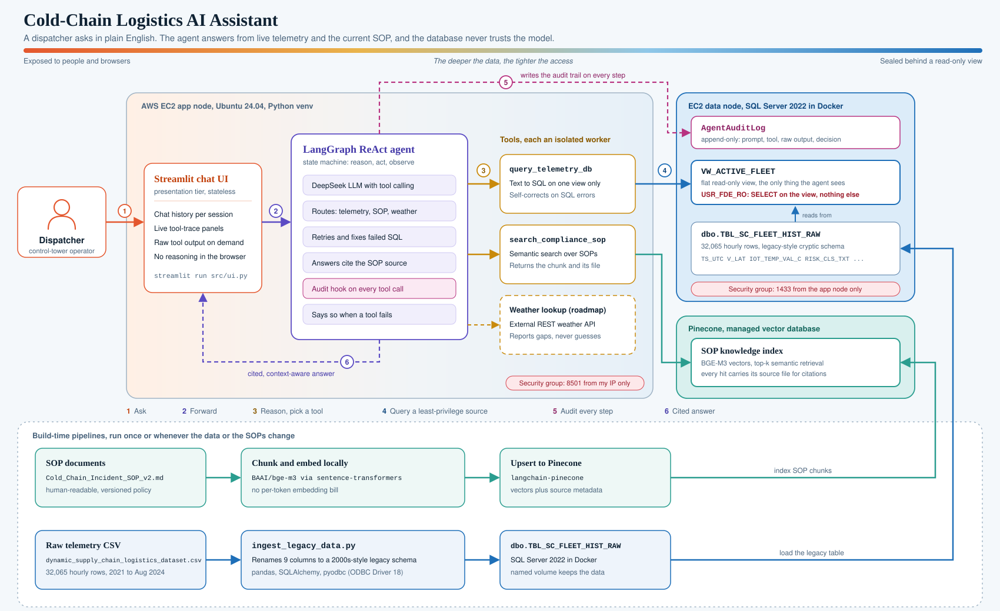

# Cold-Chain Logistics AI Assistant

An AI copilot for cold-chain dispatchers. Ask a question in plain English and the agent checks live fleet telemetry, looks up the current escalation SOP, and answers with the source it used. The database never has to trust the model: the agent can only read one view, through a login that can do nothing else, and every step it takes is written to an append-only audit table.


## At a glance

- **Problem:** when a reefer truck drifts out of its temperature band, a dispatcher has to check a dashboard, query a database, find the right SOP, and then decide whether to escalate. Each step costs minutes, and the SOP changes often.
- **Solution:** one chat interface backed by an agent that chooses between a SQL telemetry tool and an SOP search tool, then answers with citations.
- **Governance:** least-privilege database access, a view instead of raw tables, an append-only audit log, and a locked-down network.
- **Deployed on AWS:** the app and the database run on separate EC2 nodes, with SQL Server in Docker.

<!-- ## Demo -->

<!-- Add screenshots to docs/images/ and uncomment:


-->

Example questions the assistant handles:

| Question | What the agent does |
|---|---|
| "I'm a new dispatcher. What's the difference between a Tier 1 and a Tier 2 escalation?" | Searches the SOP, then explains it in dispatcher-friendly terms and cites `Cold_Chain_Incident_SOP_v2.md`. |
| "How many years of data do we have in the system?" | Writes and runs a SQL query, then reports the date span and a per-year record count. |
| "Which shipments are near the Tier 2 threshold?" | Combines the SOP rule (High Risk and delay probability above 0.65) with a telemetry query. |

Every answer shows a collapsible trace of the tool the agent called, the input it generated, and the raw output it got back, so a dispatcher can check the evidence.

## Architecture



| Step | What happens |
|---|---|
| 1. Ask | The dispatcher types a question into the Streamlit chat. |
| 2. Forward | The UI is stateless. It keeps session history and passes the message to the agent. |
| 3. Reason | A LangGraph ReAct agent, backed by DeepSeek with tool calling, decides which tool to use. It asks for clarification if the intent is ambiguous. |
| 4. Query | The SQL tool reads `VW_ACTIVE_FLEET` through `USR_FDE_RO`. The SOP tool runs a semantic search in Pinecone. |
| 5. Audit | Each decision cycle is appended to `AgentAuditLog`. |
| 6. Answer | The agent turns raw tool output into a cited, context-aware answer. |

### Design decisions

- **Security lives in the database, not in the prompt.** Prompt instructions can be talked around. A login with `SELECT` on one view cannot run `DROP`, `UPDATE` or `DELETE`, however the model is persuaded.
- **A legacy-style schema on purpose.** Real fleets run on old systems with cryptic column names. The ingestion script maps a clean CSV onto a 2000s-style schema (`TS_UTC`, `V_LAT`, `IOT_TEMP_VAL_C`, `RISK_CLS_TXT`), so the agent has to cope with realistic data rather than tidy demo data.
- **Local embeddings.** SOP chunks are embedded with `BAAI/bge-m3` on the machine, so there is no per-token embedding cost and no SOP text leaves the host for that step.
- **Separate nodes for app and data.** The database sits on its own EC2 instance and accepts connections only from the app node's security group.
- **Show the evidence.** Tool inputs and raw outputs are visible in the UI. In an operations setting, an answer that can't be checked is not useful.

## Security and governance

| Control | How it is done |
|---|---|
| Least privilege | The agent connects as `USR_FDE_RO`, which has `SELECT` on the fleet view and nothing else. |
| Controlled visibility | `VW_ACTIVE_FLEET` exposes a flat, read-only slice of the data instead of the raw tables. |
| Audit trail | `AgentAuditLog` is append-only and records the prompt, tool, raw tool output and the agent's decision. |
| Network | Port 1433 accepts traffic only from the app node's security group. Port 8501 is limited to allow-listed IPs. |
| Secrets | Keys and passwords live in a git-ignored `.env`. `.env.example` lists the variable names. |
| Failure behaviour | If a tool fails, the agent says data is missing instead of guessing. |

## Tech stack

| Layer | Technology |
|---|---|
| UI | Streamlit |
| Agent | LangGraph (ReAct), LangChain, DeepSeek LLM |
| Knowledge base | Pinecone, `BAAI/bge-m3` embeddings via sentence-transformers |
| Database | SQL Server 2022 in Docker, accessed with SQLAlchemy and pyodbc (ODBC Driver 18) |
| Data prep | pandas |
| Infrastructure | AWS EC2 (two nodes), security groups, Docker named volume |
| CI | GitHub Actions |

## Data

`scripts/ingest_legacy_data.py` loads 32,065 hourly readings (January 2021 to August 2024) into `dbo.TBL_SC_FLEET_HIST_RAW` and renames nine columns on the way in:

| Source column | Legacy column |
|---|---|
| `timestamp` | `TS_UTC` |
| `vehicle_gps_latitude` | `V_LAT` |
| `vehicle_gps_longitude` | `V_LON` |
| `iot_temperature` | `IOT_TEMP_VAL_C` |
| `cargo_condition_status` | `CGO_COND_CD` |
| `risk_classification` | `RISK_CLS_TXT` |
| `delay_probability` | `DELAY_PROB_DEC` |
| `port_congestion_level` | `PRT_CNG_LVL` |
| `route_risk_level` | `RT_RSK_IDX` |

It also adds a `SYS_INGEST_FLAG` column, to mimic an automated legacy feed.

## Getting started

### Prerequisites

- Python 3.12 and Docker
- ODBC Driver 18 for SQL Server (on Windows: `winget install Microsoft.msodbcsql.18`)
- A Pinecone API key and a DeepSeek API key

### Setup

```bash
git clone https://github.com/PriyanshuDhingra/Cold-chain-logistics-AI-Assistant.git
cd Cold-chain-logistics-AI-Assistant
python -m venv venv
source venv/bin/activate        # Windows: venv\Scripts\activate
pip install -r requirements.txt
```

Start SQL Server with a named volume so the data survives container removal:

```bash
docker run -e "ACCEPT_EULA=Y" -e "MSSQL_SA_PASSWORD=<strong-password>" \
  -p 1433:1433 -v mssql_data:/var/opt/mssql \
  --name legacy-mssql -d mcr.microsoft.com/mssql/server:2022-latest
```

Copy `.env.example` to `.env` and fill it in:

```env
PINECONE_API_KEY=
DEEPSEEK_API_KEY=

Embeddings_model=LOCAL
Local_Embedding_Model=BAAI/bge-m3
Agent_llm=DEEPSEEK

SQL_ADMIN_USER=sa
SQL_ADMIN_PASSWORD=
SQL_AGENT_USER=USR_FDE_RO
SQL_AGENT_PASSWORD=

SQL_SERVER_HOST=localhost
SQL_SERVER_PORT=1433
```

Load the data, then start the app:

```bash
python scripts/ingest_legacy_data.py
streamlit run src/ui.py
```

Open `http://localhost:8501`.

## Deploying on AWS

| Node | Runs | Inbound rules |
|---|---|---|
| App node (EC2) | Streamlit and the LangGraph agent | 22 from your IP, 8501 from allow-listed IPs |
| Data node (EC2) | SQL Server 2022 in Docker | 22 from your IP, 1433 from the app node's security group only |

Point `SQL_SERVER_HOST` at the data node's **private** IP. Private IPs survive stop and start, and they keep the database off the public internet.

## Project structure

```
.github/workflows/   CI
.streamlit/          Streamlit configuration
data/                dataset (see Data)
docs/                architecture diagram and design documents
scripts/             data ingestion
src/                 agent, tools and Streamlit UI
requirements.txt
```

## Roadmap

- [ ] Weather tool for route-level risk (the agent already degrades gracefully when a tool is unavailable)
- [ ] Human-in-the-loop approval before the agent recommends a diversion
- [ ] Sign-in for the Streamlit app
- [ ] Infrastructure as code (Terraform) and a private subnet for the data node
- [ ] An evaluation set of dispatcher questions with expected tool choices